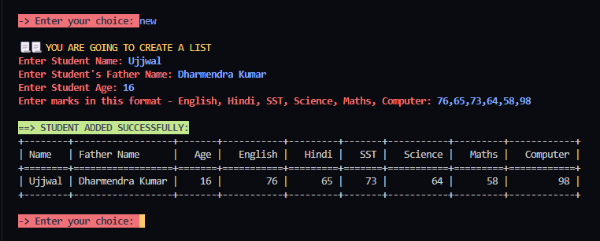
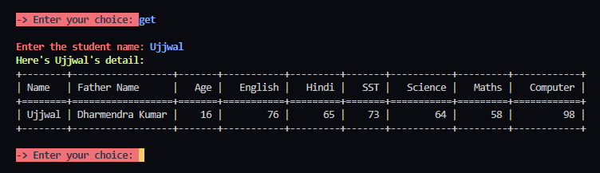

<body>
    <h1>EasyStud - Student Record Management</h1>
    
EasyStud is a Python script designed to help you manage student records with ease. It supports functionalities such as adding, updating, retrieving, and removing student data, as well as performing basic mathematical operations on student marks. The script stores data in an Excel file for easy access and manipulation.

    
<h2>Features</h2>
    <ul>
        <li>Add new student records</li>
        <li>Update existing student records</li>
        <li>Retrieve student details</li>
        <li>Remove student records</li>
        <li>Perform basic math operations on student marks</li>
        <li>Colorful and user-friendly console output</li>
    </ul>

  <h2>Screenshots</h2>
    <table>
        <tr>
            <td>
                
                
Main Menu

            </td>
            <td>
                
                
Adding a New Student

            </td>
        </tr>
        <tr>
            <td>
                
                
Student Details

            </td>
            <td>
                
                
Updating Student Data

            </td>
        </tr>
        <tr>
            <td>
                
                
Performing Math Operations

            </td>
            <td>
                
                
Show main menu

            </td>
        </tr>
    </table>
    
  <h2>Requirements</h2>
    
The script requires the following Python libraries:

    <ul>
        <li><code>pyfiglet</code></li>
        <li><code>pandas</code></li>
        <li><code>tabulate</code></li>
        <li><code>colorama</code></li>
    </ul>
    
You can install these dependencies using the provided <code>requirements.txt</code> file.

    
   <h2>Installation</h2>
  <ol>
        <li>
            
Clone the repository:

            <pre><code>git clone https://github.com/yourusername/easystud.git
cd easystud</code></pre>
        </li>
        <li>
            
Install the dependencies:

            <pre><code>pip install -r requirements.txt</code></pre>
        </li>
    </ol>
    
   <h2>Usage</h2>
    
Run the script:

    <pre><code>python easystud.py</code></pre>
    
Follow the on-screen instructions to interact with the script.

    <h3>Main Menu</h3>
    <pre><code>What would you like to do today??
--> Add more students: new
--> Add new data to a student: add
--> Get student detail: get
--> Remove student: rmv
--> Do basic maths: math
--> Get this guide: help
--> Exit the program: exit</code></pre>
    
 <h3>Adding a New Student</h3>
    
When adding a new student, you'll be prompted to enter the student's name, father's name, age, and marks in six subjects (English, Hindi, SST, Science, Maths, Computer). The data will be stored in an Excel file (<code>data.xlsx</code>).

    
 <h3>Performing Math Operations</h3>
    
You can perform basic math operations such as addition, averaging marks, and calculating percentages. The script will prompt you to select a student and then choose the type of math operation to perform.

    
  <h3>Example</h3>
    <pre><code>Enter the student name: Ujjwal
==> Student found!!
Marks of Ujjwal:
English: 43
Hindi: 43
SST: 54
Science: 65
Maths: 23
Computer: 53

Which math??
--> Addition (+): 1
--> Average (x): 2
--> Percentage (%): 3

Choose math to perform: 3
Enter Score Marks: 240
==> Percentage of entered values:  85.41 %</code></pre>
    
 <h2>Contributing</h2>
    
Contributions are welcome! Please open an issue or submit a pull request if you have any suggestions or improvements.

    
 <h2>License</h2>
    
This project is licensed under the MIT License.

</body>
</html>
